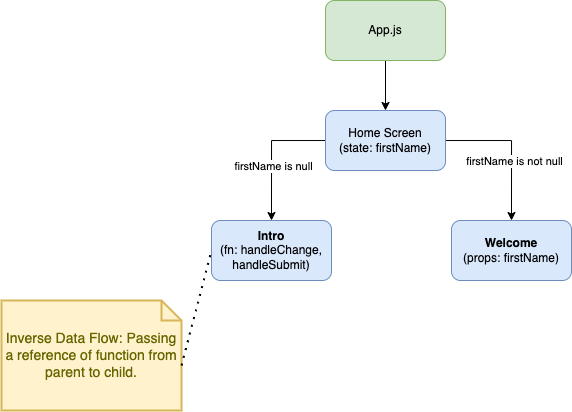

# Mentoring Session with Students

## Objectives

Demo Objectives:
- Component
- Props as value
- Props as function
- `useState` hook

## Running this project

After cloning, use the following commands to start the project.

```sh
npm install && npm start
```

## Component Overview

